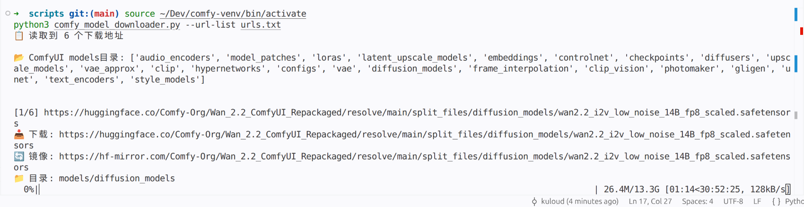

# 脚本工具集

实用脚本工具集合。

## ComfyUI 模型批量下载工具

使用国内镜像代理批量下载 Hugging Face 模型到 ComfyUI 目录。

### 功能特点

- ✅ **国内镜像加速** - 自动替换为 `hf-mirror.com` 镜像源
- ✅ **动态目录匹配** - 自动扫描 ComfyUI models 目录结构
- ✅ **批量下载** - 支持从列表文件批量下载，跳过失败项继续执行
- ✅ **智能分类** - 根据URL路径和文件名自动识别目标目录

### 界面预览



### 项目结构

```
scripts/
├── comfy_model_downloader.py    # 模型下载脚本
├── urls.txt                     # 下载地址列表
├── file_organizer.py            # 文件整理脚本
├── screenshots/
│   └── comfy_downloader.png     # 截图
└── README.md
```

### 快速开始

#### 1. 安装依赖

```bash
pip install requests tqdm
```

#### 2. 准备下载列表

编辑 `urls.txt` 文件，每行一个下载链接（`#` 开头为注释）：

```txt
# ComfyUI 模型下载列表

# Wan 2.2 模型
https://huggingface.co/Comfy-Org/Wan_2.2_ComfyUI_Repackaged/resolve/main/split_files/diffusion_models/wan2.2_i2v_low_noise_14B_fp8_scaled.safetensors

# Stable Diffusion v1.5
https://huggingface.co/runwayml/stable-diffusion-v1-5/resolve/main/v1-5-pruned-emaonly.safetensors

# SDXL VAE
https://huggingface.co/stabilityai/sdxl-vae/resolve/main/sdxl-vae.safetensors
```

#### 3. 运行下载

```bash
# 使用默认路径 ~/comfy/ComfyUI
python3 comfy_model_downloader.py --url-list urls.txt

# 指定自定义 ComfyUI 路径
python3 comfy_model_downloader.py --url-list urls.txt --comfy-path /path/to/comfyui
```

### 使用说明

#### 命令行参数

| 参数 | 说明 | 默认值 |
|------|------|--------|
| `--url-list` | 下载地址列表文件路径 | 必需 |
| `--comfy-path` | ComfyUI 根目录路径 | `~/comfy/ComfyUI` |

#### 动态目录匹配规则

脚本会自动扫描 `ComfyUI/models/` 目录下的所有子目录，按以下规则匹配：

1. 读取 ComfyUI models 目录下的所有子目录名称
2. 在URL路径和文件名中查找匹配的目录名
3. 找到匹配则使用对应目录，否则默认使用 `models/checkpoints`

**匹配示例：**

| URL 关键词 | 目标目录 |
|------------|----------|
| `diffusion_models` | `models/diffusion_models` |
| `lora` | `models/loras` |
| `controlnet` | `models/controlnet` |
| `vae` | `models/vae` |
| `embedding` | `models/embeddings` |
| 其他 | `models/checkpoints` |

#### 批量下载特性

- 支持 `#` 注释行和空行
- 单个下载失败不影响其他任务
- 显示下载进度条
- 最终统计成功/失败数量

### 常用模型推荐

#### Diffusion Models

```txt
# Wan 2.2
https://huggingface.co/Comfy-Org/Wan_2.2_ComfyUI_Repackaged/resolve/main/split_files/diffusion_models/wan2.2_i2v_low_noise_14B_fp8_scaled.safetensors

# Stable Diffusion XL
https://huggingface.co/stabilityai/stable-diffusion-xl-base-1.0/resolve/main/sd_xl_base_1.0.safetensors
```

#### VAE Models

```txt
# SDXL VAE
https://huggingface.co/stabilityai/sdxl-vae/resolve/main/sdxl-vae.safetensors

# FP16 VAE
https://huggingface.co/madebyollin/sdxl-vae-fp16-fix/resolve/main/sdxl-vae-fp16-fix.safetensors
```

#### LoRA Models

```txt
# Pony LoRA
https://huggingface.co/KappaVLeo/pony Diffusion_v6/sDXL08.safetensors
```

### 注意事项

1. 确保网络连接正常
2. 下载大模型需要较长时间，请耐心等待
3. 如遇下载失败，脚本会自动跳过并继续下载其他模型
4. 确保有足够的磁盘空间

## 文件批量整理工具

用于批量重命名或删除文件/目录的脚本。

### 功能

- ✅ 批量重命名文件/目录
- ✅ 批量删除文件/目录
- ✅ 支持正则表达式匹配
- ✅ 递归查找
- ✅ 预览模式

### 安装

```bash
# 无需额外依赖，使用Python标准库
```

### 使用方法

#### 1. 批量删除文件

```bash
# 删除当前目录下所有 .tmp 文件（预览模式）
python3 file_organizer.py --pattern '\.tmp$' --action delete --preview

# 实际删除（会有确认提示）
python3 file_organizer.py --pattern '\.tmp$' --action delete

# 递归删除所有 .bak 文件
python3 file_organizer.py --dir /path/to/dir --pattern '\.bak$' --action delete --recursive
```

#### 2. 批量重命名文件

```bash
# 预览重命名（将所有 .txt 文件重命名为 new_{name}.txt）
python3 file_organizer.py --pattern '\.txt$' --action rename --new-name 'new_{name}' --preview

# 实际重命名
python3 file_organizer.py --pattern '\.txt$' --action rename --new-name 'new_{name}'

# 递归重命名（添加前缀）
python3 file_organizer.py --dir /path/to/dir --pattern '^photo' --action rename --new-name 'vacation_{name}' --recursive
```

### 参数说明

| 参数 | 说明 | 默认值 |
|------|------|--------|
| `--dir` | 目标目录 | `.` (当前目录) |
| `--pattern` | 匹配模式（正则表达式） | 必需 |
| `--action` | 操作类型 (`rename` 或 `delete`) | 必需 |
| `--new-name` | 新文件名模式（仅重命名时需要） | - |
| `--recursive` | 递归查找 | `False` |
| `--preview` | 预览模式，不执行实际操作 | `False` |

### 新文件名模式

在 `--new-name` 参数中可以使用以下占位符：

- `{name}` - 原始文件名（包含扩展名）
- `{ext}` - 原始文件扩展名（不包含点）

**示例：**
- `new_{name}` → `new_original.txt`
- `{name}_backup` → `original_backup.txt`
- `file_{ext}` → `file_txt.txt`

### 正则表达式示例

| 模式 | 匹配内容 |
|------|----------|
| `\.tmp$` | 所有 .tmp 文件 |
| `^photo` | 以 photo 开头的文件 |
| `202[3-5]` | 包含 2023、2024、2025 的文件 |
| `\.(jpg|png)$` | 所有 jpg 或 png 文件 |
| `backup` | 包含 backup 的文件 |

### 安全提示

1. **使用预览模式**：在执行删除操作前，先使用 `--preview` 查看匹配结果
2. **确认操作**：删除操作会有确认提示
3. **递归操作**：使用 `--recursive` 时要特别小心，可能会影响深层目录
4. **备份重要文件**：在执行批量操作前，建议备份重要文件

### 示例

#### 示例 1: 清理临时文件

```bash
# 删除所有临时文件
python3 file_organizer.py --pattern '\.(tmp|temp|backup)$' --action delete --recursive
```

#### 示例 2: 重命名照片

```bash
# 重命名所有照片文件，添加日期前缀
python3 file_organizer.py --pattern '\.(jpg|png|jpeg)$' --action rename --new-name '2024_{name}'
```

#### 示例 3: 整理文档

```bash
# 重命名所有文档文件，按类型分类
python3 file_organizer.py --pattern '\.pdf$' --action rename --new-name 'document_{name}'
```
